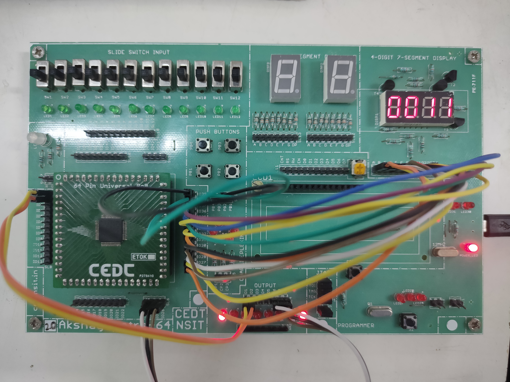

# dual_dice

The dice game is a demo project to show the working of logic devices with the use of 'Akshayapatra'. Akshayapatra is a CPLD development board based on **Xilinx XC9572XL-10VQG64C**.
It is designed and developed at CEDT, NSIT. Dual dice is an intuitive game based upon some defined rules for play.

CPLD stands for Complex Programmable Logic Devices which is a free bucket of thousands of gates available for the user and can be connected by programming. The CPLD is a combination of a fully programmable AND/OR array and a bank of macrocells. The array is reprogrammable and can perform a multitude of logic functions. Macrocells are functional blocks that perform combinatorial or sequential logic, and also have the added flexibility for true or complement, along with varied feedback paths.
The CPLD used for this specific project is Xilinx XC9572XL-10VQG64C. This CPLD ic runs on 3.3V and has **72 macrocells** with a maximum count of **52 input/output pins**. The rest of the pins are dedicated for special purposes.
Macrocells are key components of PLD devices. It contains logic implementing disjunctive normal form expression and more specialized logic operations.

## Working
The program into the CPLD is fed by the JTAG protocol pins.
The code is written in VHDL in Xilinx ISE. The main part of this project is a finite state machine which is coded inside the CPLD. The FSM takes in the inputs from the buttons and according to its present state decides the output and the next jump to another state. This all is implemented with flip-flops and some other combinational logic.
The state machine with the help of some pre-defined blocks constitutes the entire project. The blocks generate some data which is manipulated by the main FSM design required to proceed further. The FSM control the blocks with some control signals. The entire set consisting of the control signals with the blocks is called datapath and the blocks are called elements of datapath.
||
|:--:|
|*FSM for dual dice game*|
## Elements of datapath

1. **Debouncing Circuit-** A mechanical switch is used for taking an input of the project. It will suffer from bouncing i.e. it will toggle between logic 0 and 1 multiple times before coming to a stable state. This phenomenon is always observed while pressing or releasing the switch for almost 10-20ms. Passing such input to a state machine could lead to unexpected state transition and illegal output. So it must be made clean and only one pulse should be generated for each press. And this circuit exactly serves the purpose with the help of a counter and some more logic. The output is clean and can be fed into the state machine.

1. **Counter-** To simulate the throwing of 2 dice together, there is a counter working inside that is counting from 2-12 because the sum of 2 dice will be in this exact range. The counter counts at a very fast rate and hence its output can be thought of as random when stopped unexpectedly though it’s not. It is enabled by the switch press and stops when the switch is released.

1. **Comparators-** A total of seven 4-digit counters are employed to compare the obtained sum with the set values which tell the user about the condition of win, lose or neither of these i.e. to the second stage of the game.

1. **Latch with enable-** A 4-bit latch is used to save the immediate previous sum obtained required for comparing with the present sum obtained required in the second stage.

1. **Seven Segment Decoder and Multiplexer-** The 2-digit present sum and last obtained sum must be displayed on the 4-digit multiplexed Seven Segment Display. It has two individual parts. One is a 4-bit to 7-segment decoder which decodes the 4-bit binary number to its seven-segment equivalent. The other and the more important part is an FSM which turns on one digit at a time and accordingly sends out the correct decoded code for it. The rate at which all the digits are sequentially turned on at a rate faster than the human persistence of vision. In this way, all of the four digits appear to be ON at the same time whereas only one of it at any particular time instant.

## Pictures of wired Akshayapatra

